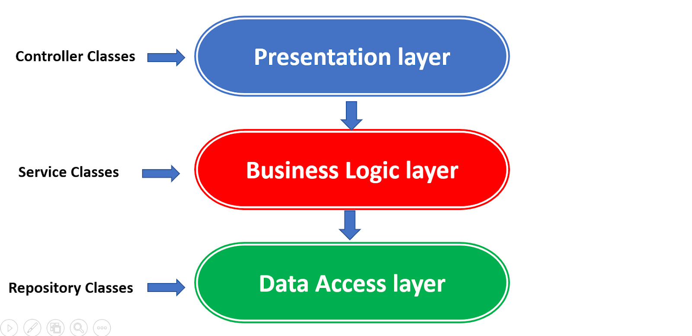

# Building a Tree N-Tier Architecture Project in .NET Core 8 Web API

Article : https://medium.com/@cydexcode/building-a-tree-n-tier-architecture-project-in-net-core-8-web-api-100dddc5cfd9

This repository contains a detailed tutorial on building a tree N-tier architecture project in .NET Core 8 Web API. N-tier architecture is a structured approach to software development that divides an application into multiple layers, each responsible for a specific aspect of functionality. By employing this architecture, developers can achieve modularity, separation of concerns, scalability, flexibility, reusability, and improved testability.

## Introduction

The article starts with an overview of layered architecture in .NET, emphasizing its benefits and common technologies used in its implementation. It then outlines the structure of the tree N-tier architecture project, which consists of three main layers:

1. **Presentation Layer**: Responsible for presenting information to users and handling user input through interfaces like web pages or API endpoints.
2. **Business Logic Layer (Service Layer)**: Contains the core functionality and rules of the application, implementing business processes, workflows, validations, and calculations.
3. **Data Access Layer**: Handles interactions with the underlying data storage, such as a database or external services, abstracting data storage implementation details and providing a consistent interface for data access.

## Implementation Steps

The article provides detailed steps to create a simple Todo list application using a layered architecture in .NET Core:

1. **Creation of All Layers**: Guides readers through creating projects for each layer (Presentation, Services, and DataAccess) and setting up the initial structure.
2. **Implementing DataAccess Layer**: Demonstrates defining data models and setting up Entity Framework Core for database interactions.
3. **Implementing Services Layer**: Explains the creation of service interfaces and classes to handle business logic operations.
4. **Implementing Presentation Layer**: Walks through setting up API controllers to interact with the services layer and handle HTTP requests.
5. **Dependency Injection Configuration**: Shows how to configure dependency injection to inject dependencies into controllers and other classes, promoting loose coupling and testability.

## Conclusion

In conclusion, the article showcases a basic implementation of a Todo list application with CRUD operations using ASP.NET Core Web API and a tree N-tier architecture. It emphasizes the benefits of using a layered architecture approach for building scalable, maintainable, and testable applications.

---

## Check Out My Blog 

- **Blog (Medium):** [https://medium.com/@cydexcode](https://medium.com/@cydexcode)

---

Thank you for your support!

🚀 Follow CydexCode on YouTube , TikTok , Linkedin , Facebook , and Telegram for more exciting content! 🎉📱💻📢
